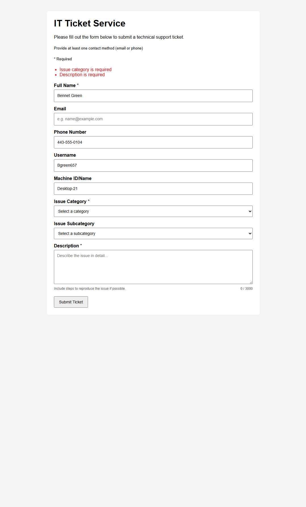
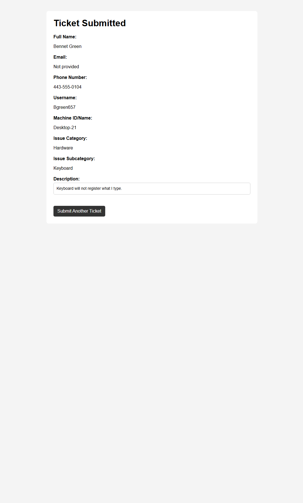

# IT Ticket Service Capstone

This capstone project focuses on creating an IT ticket service that allows users to submit technical issues, enables technicians to review and update tickets, and supports escalation, resolution, and feedback.

## Current Status
The project has progressed significantly and is now in an advanced frontend and early backend integration phase. The user interface for the IT ticket submission system is fully functional, including the form layout, input fields, category and subcategory selection behavior, and a confirmation page for submitted tickets.  

The admin/technician dashboard is operational, allowing ticket status updates both individually and in bulk, with visual indicators updating dynamically. Filters for status, category, and other fields have been implemented, and the Reset and Apply buttons are now visually aligned and functional.  

Backend integration using Flask has begun, including database connectivity, ticket storage, and session-based persistence for form state. User-specific ticket views have been added to ensure users can only see their submitted tickets, enhancing security.  

The project now combines a robust frontend experience with functional backend operations, with remaining tasks focused on final backend features, ticket filtering logic, feedback handling, and any remaining UI refinements.

## Documentation
- [Project Scope](docs/project-scope.md)
- [Workflow Diagram](docs/workflow-diagram.md)

## Current Capstone Progress

