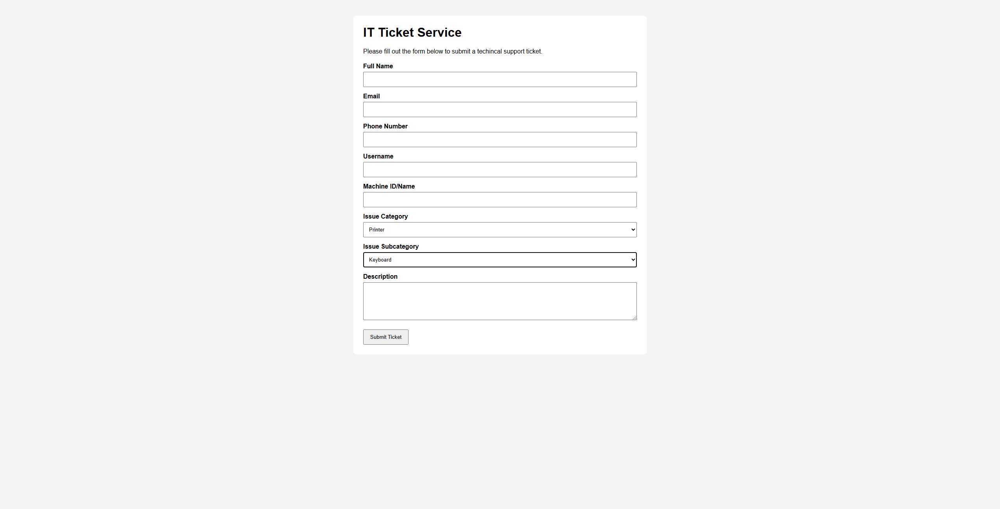

# IT Ticket Service Capstone

This capstone project focuses on creating an IT ticket service that allows users to submit technical issues, enables technicians to review and update tickets, and supports escalation, resolution, and feedback.

## Current Status
In progress. Planning and documentation are complete, and implementation is beginning.

## Documentation
- [Project Scope](docs/project-scope.md)
- [Workflow Diagram](docs/workflow-diagram.md)

## Current Capstone Progress

