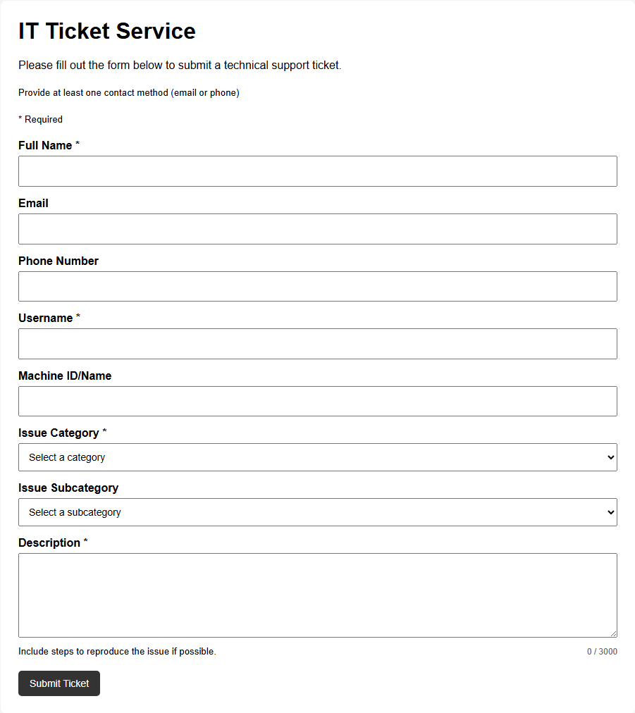
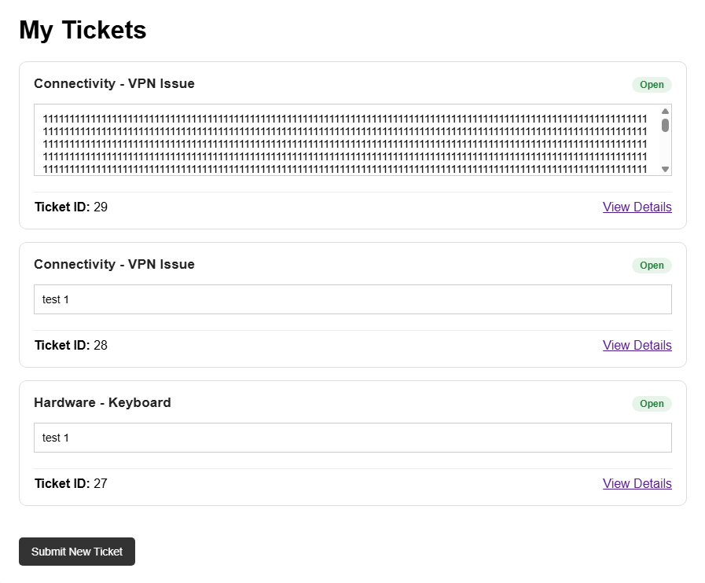
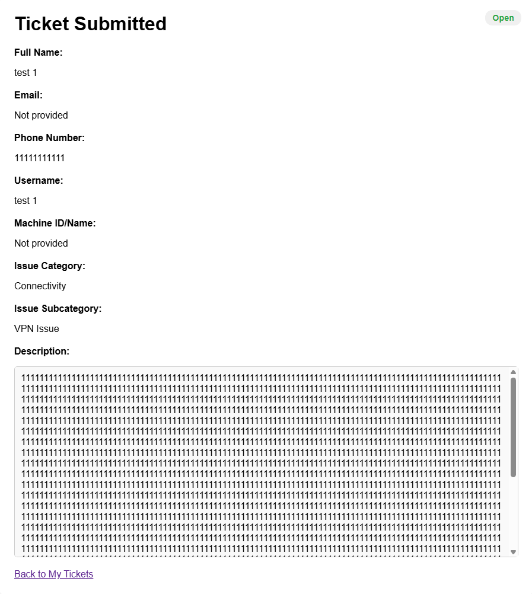

# IT Ticket Service Capstone

This capstone project focuses on creating an IT ticket service that allows users to submit technical issues, enables technicians to review and update tickets, and supports escalation, resolution, and feedback.

## Current Status
The project now has a functional frontend and initial backend integration. Ticket submission, confirmation, and user-specific ticket views work correctly. The My Tickets and Ticket Submitted pages have consistent styling, including status badges and scrollable description boxes. Backend Flask integration supports ticket storage and session-based form persistence. Remaining work focuses on backend features, filtering logic, feedback handling, and minor UI refinements.

## Documentation
- [Project Scope](docs/project-scope.md)
- [Workflow Diagram](docs/workflow-diagram.md)

## Current Capstone Progress

