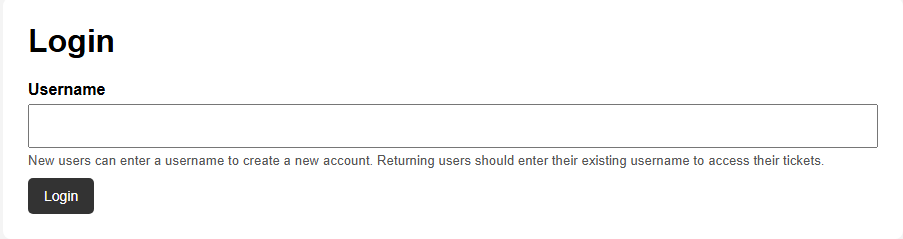
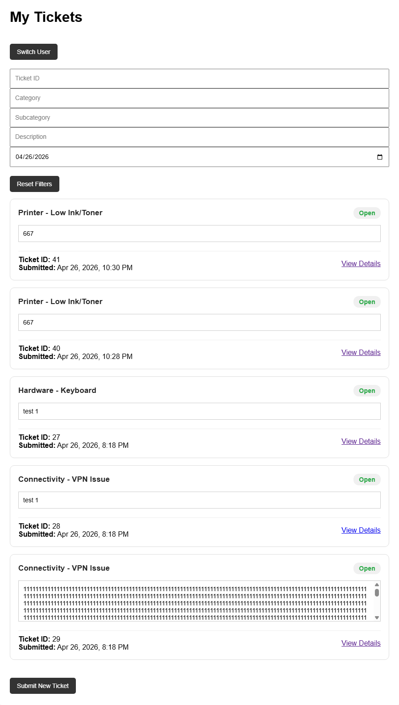
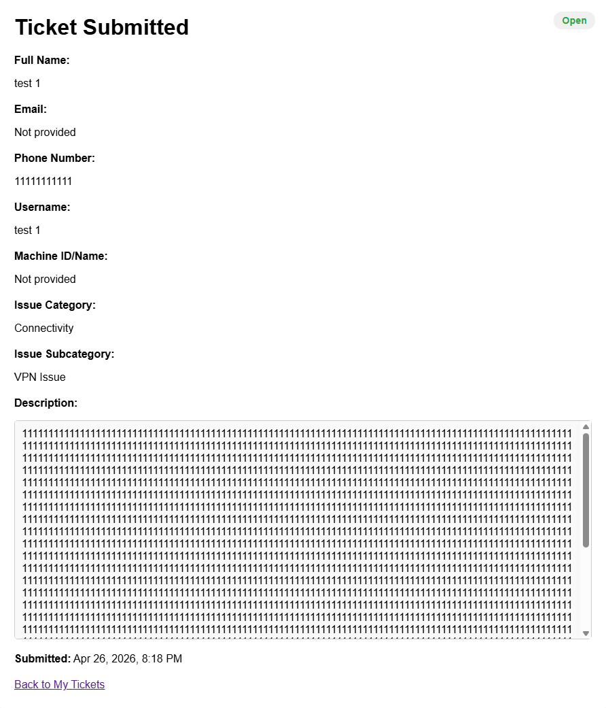
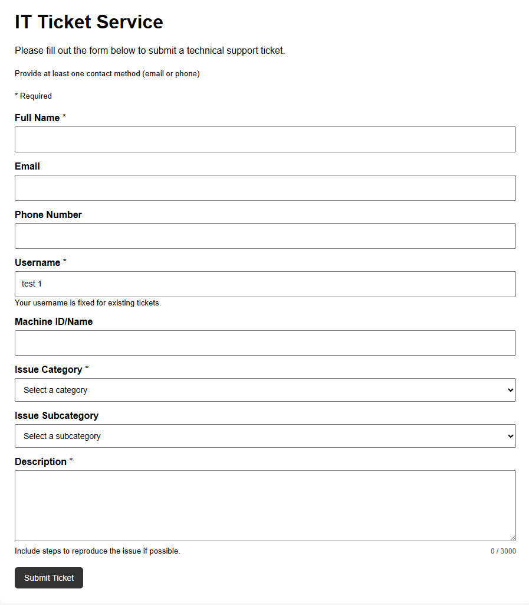

# IT Ticket Service Capstone

This capstone project focuses on creating an IT ticket service that allows users to submit technical issues, enables technicians to review and update tickets, and supports escalation, resolution, and feedback.

## Current Status
The project now includes secure user authentication with hashed passwords and session-based access control, ensuring users can only view their own tickets. Ticket submission, confirmation, and user-specific views are fully functional, and the My Tickets page has been streamlined into a clean summary dashboard with description previews and resolution note indicators. The admin view supports full ticket management, including status and resolution note updates (individual and bulk). The system is stable, consistent in UI, and ready for final enhancements such as feedback features and minor refinements.

## Documentation
- [Project Scope](docs/project-scope.md)
- [Workflow Diagram](docs/workflow-diagram.md)

## Current Capstone Progress

