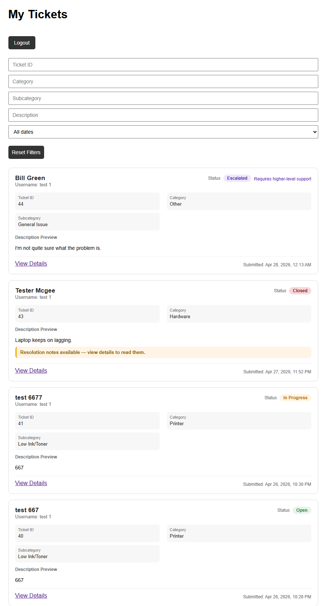
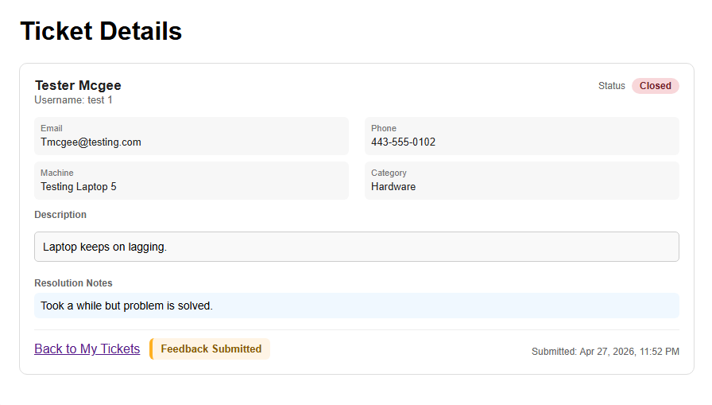
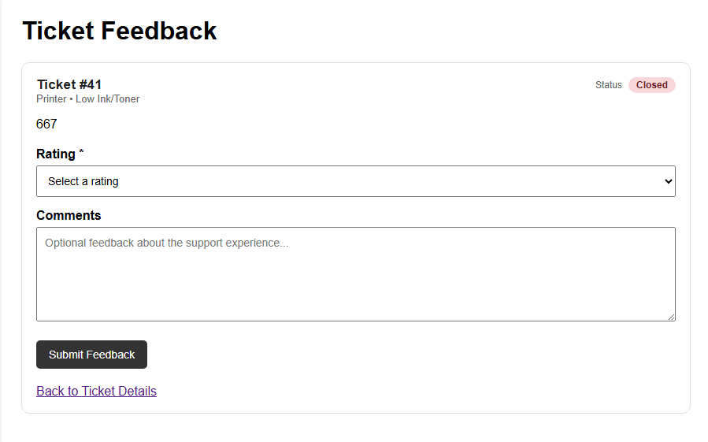
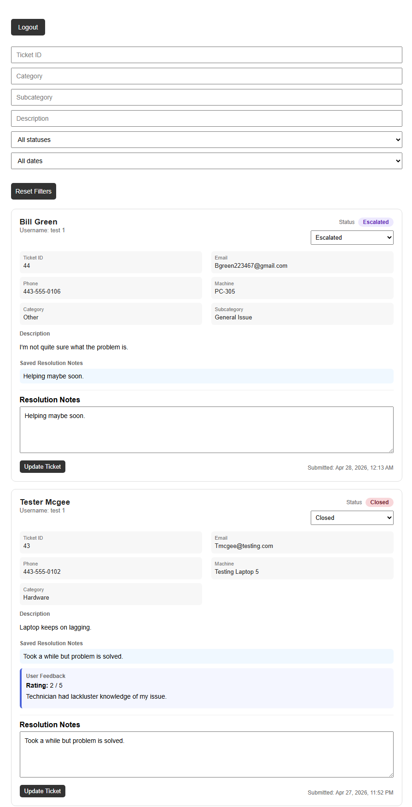

# IT Ticket Service Capstone

This capstone project focuses on creating an IT ticket service that allows users to submit technical issues, enables technicians to review and manage tickets, and supports escalation, resolution, and user feedback.

## Current Status
The project includes secure user authentication with hashed passwords and session-based access control, ensuring users can only view their own tickets. Ticket submission, confirmation, and user-specific views are fully functional. The My Tickets page provides a clean dashboard with filtering, status tracking, and resolution note indicators.

The admin interface supports full ticket management, including status updates (Open, In Progress, Escalated, Closed), resolution notes, and bulk updates. A feedback system allows users to rate and comment on resolved tickets, and escalation handling supports routing issues to higher levels of support. The system is stable, consistent in UI, and ready for final submission.

## Documentation

Detailed project documentation can be found in the `/docs` folder, including:
- [Development Logs](docs/development-log.md)
- [Page Plan](docs/page-plan.md)
- [Project Scope](docs/project-scope.md)
- [Technology Stack](docs/technology-stack.md)
- [Testing Notes](docs/testing-notes.md)
- [Time Logs](docs/time-log.md)
- [Workflow Diagram](docs/workflow-diagram.md)

## Code Structure

The core application is built using Python (Flask) for the backend and HTML, CSS, and JavaScript for the frontend.

- [`app.py`](app.py) contains the Flask backend, routes, authentication, role-based access control, ticket management, and database logic.
- [`templates/`](templates/) contains the HTML pages for login, ticket submission, user ticket views, admin dashboard, ticket details, and feedback.
- [`static/`](static/) contains the frontend styling and JavaScript used for layout, form behavior, and UI improvements.
- `tickets.db` is a SQLite database used to store users, tickets, and feedback. It is automatically initialized and updated through the Flask application.

Together, these files support user authentication, ticket submission, admin ticket management, escalation handling, resolution notes, and feedback collection.

## Technologies Used

- Python (Flask)
- SQLite
- HTML, CSS, JavaScript
- Session-based Authentication
- Role-Based Access Control

## Current Capstone Progress

### User Experience

*Secure login page with username and password authentication, supporting both new account creation, returning user access, and admin/technician access.*

*User-specific ticket dashboard displaying submitted tickets with filtering options and real-time status tracking.*

### Ticket Management

*Detailed view of a submitted ticket while the issue is still in progress.*

*Completed ticket view displaying final resolution notes and submitted feedback notes. Feedback and resolution notes only appear once the issue has been marked as closed.*

*Ticket feedback form for displaying notes or feedback the user had on the service provided.*

### Admin Interface

*Administrative dashboard for managing all tickets, including status updates, escalation handling, resolution notes, bulk update functionality, and per ticket feedback.*
