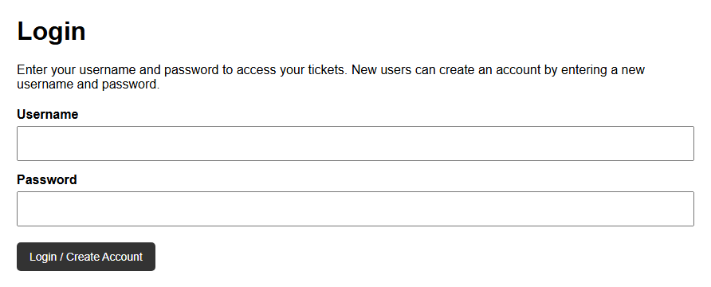
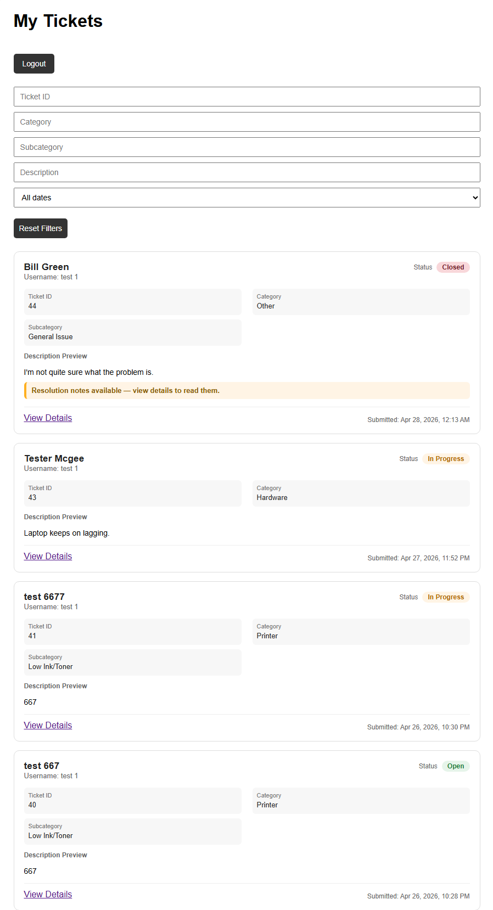
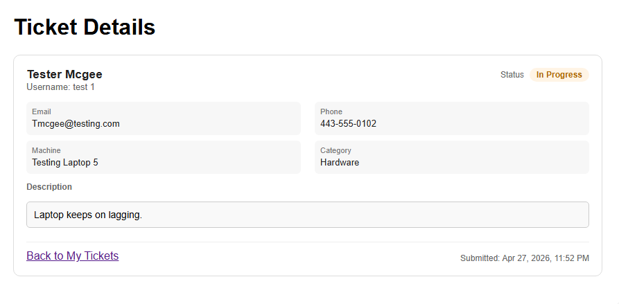
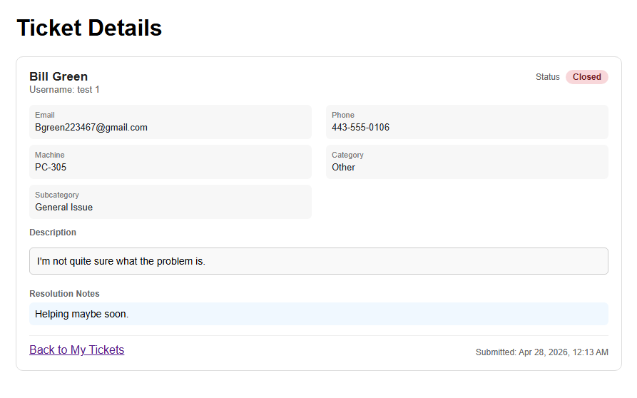
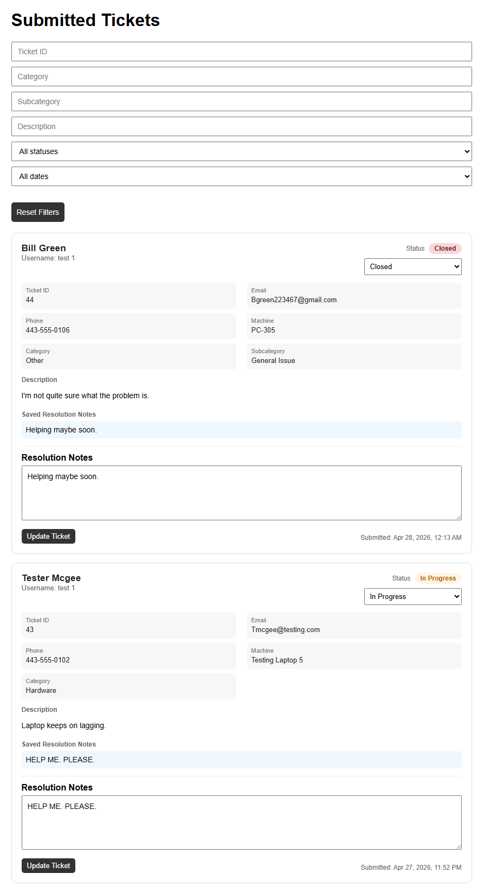

# IT Ticket Service Capstone

This capstone project focuses on creating an IT ticket service that allows users to submit technical issues, enables technicians to review and manage tickets, and supports escalation, resolution, and user feedback.

## Current Status
The project includes secure user authentication with hashed passwords and session-based access control, ensuring users can only view their own tickets. Ticket submission, confirmation, and user-specific views are fully functional. The My Tickets page provides a clean dashboard with filtering, status tracking, and resolution note indicators.

The admin interface supports full ticket management, including status updates (Open, In Progress, Escalated, Closed), resolution notes, and bulk updates. A feedback system allows users to rate and comment on resolved tickets, and escalation handling supports routing issues to higher levels of support. The system is stable, consistent in UI, and ready for final submission.

## Documentation

Detailed project documentation can be found in the `/docs` folder, including:
- [Development Logs](docs/development-log.md)
- [Page Plan](docs/page-plan.md)
- [Project Scope](docs/project-scope.md)
- [Technology Stack](docs/technology-stack.md)
- [Testing Notes](docs/testing-notes.md)
- [Time Logs](docs/time-log.md)
- [Workflow Diagram](docs/workflow-diagram.md)

## Technologies Used

- Python (Flask)
- SQLite
- HTML, CSS, JavaScript
- Session-based Authentication
- Role-Based Access Control

## Current Capstone Progress

### User Experience

*Secure login page with username and password authentication, supporting both new account creation and returning user access.*

*User-specific ticket dashboard displaying submitted tickets with filtering options and real-time status tracking.*

### Ticket Management

*Detailed view of a submitted ticket while the issue is still in progress.*

*Completed ticket view displaying final resolution notes once the issue has been marked as closed.*

*Ticket feedback form displaying notes the user had on the service provided*

### Admin Interface

*Administrative dashboard for managing all tickets, including status updates, escalation handling, resolution notes, bulk update functionality, and per ticket feedback.*
